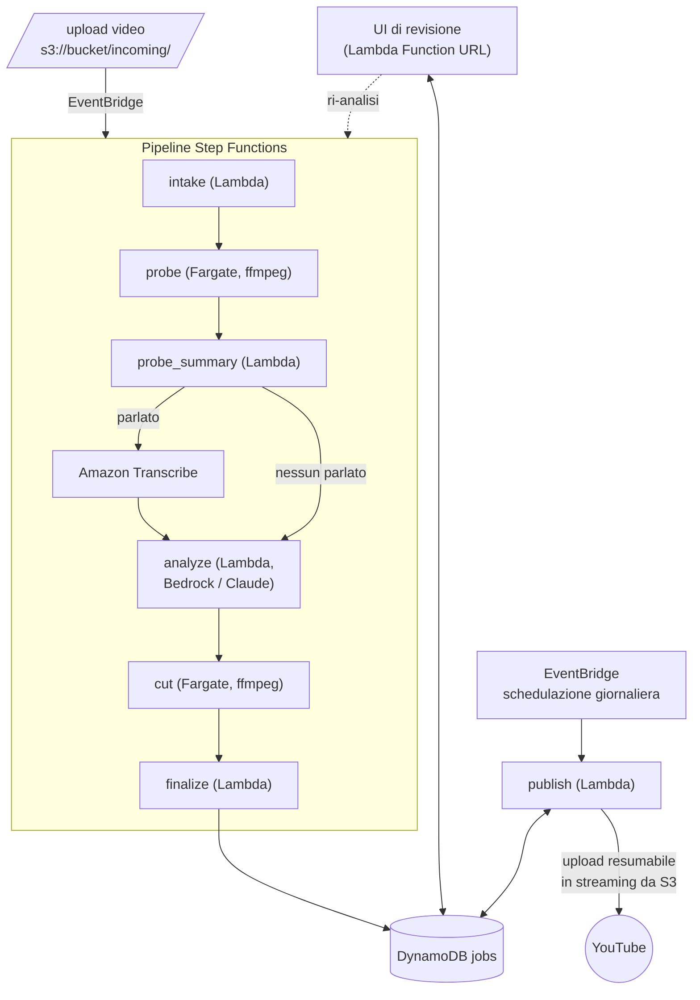

> **Sviluppo assistito dall'intelligenza artificiale**  
> Questo progetto utilizza strumenti di intelligenza artificiale durante lo sviluppo, sotto continua supervisione umana. Le decisioni architetturali, editoriali, di sicurezza e di rilascio restano soggette a revisione umana.

# another-youtube-auto-publisher

Pubblicazione YouTube completamente automatizzata su AWS: carichi un video
grezzo su S3, la pipeline lo analizza con Claude (Bedrock, visione), estrae gli
Shorts più significativi, genera i metadati in inglese e pubblica tutto con
cadenza giornaliera, dopo un passaggio di revisione umana.

> **Lingue disponibili**: [English](README.md) | [Italiano (corrente)](README.it.md)

## Architettura



Il worker e le Lambda si scambiano gli artefatti attraverso il bucket
(`work/<job>/` per output del probe, mosaici, trascrizione e piano;
`ready/<job>/` per le clip 9:16 renderizzate).

## Flusso

1. **intake** — l'evento S3 crea il record del job (un sidecar opzionale
   `<video>.json` può fornire `youtube_id` per un video già su YouTube,
   `language` per saltare l'identificazione della lingua, `prompt` come
   indicazioni libere per l'analisi).
2. **probe** (Fargate, ffmpeg) — metadati, cambi di scena, curva del volume,
   rilevamento del parlato (VAD), mosaici di frame con timestamp, traccia audio.
3. **transcribe** — Amazon Transcribe, solo se è stato rilevato parlato.
4. **analyze** — Claude su Bedrock legge mosaici + trascrizione e pianifica i
   segmenti degli Shorts più i metadati in inglese per tutto.
5. **cut** (Fargate, ffmpeg) — renderizza ogni segmento come Short 9:16
   (sfondo sfocato, frame originale centrato, contenuto intatto).
6. **finalize** — il job passa a `PENDING_REVIEW`.
7. **revisione** — approvi nella web UI, oppure correggi il prompt e ri-analizzi.
8. **publish** (giornaliero) — il video principale viene caricato come non in
   elenco, poi uno Short al giorno (ognuno con il link al video completo);
   quando tutti gli Shorts sono online il video principale diventa pubblico e
   il job è `DONE`.

Ciclo di vita del job: `ANALYZING → PENDING_REVIEW → APPROVED → PUBLISHING →
DONE` (`ERROR` da ogni stato attivo; la ri-analisi è permessa da revisione ed
errore).

## Struttura

| Percorso | Ruolo |
|---|---|
| `autopublisher/models.py` | Modello di dominio puro: job, Shorts, transizioni, regole dei metadati YouTube |
| `autopublisher/storage.py` | Persistenza su DynamoDB |
| `autopublisher/pipeline.py` | Lambda di raccordo per Step Functions (intake / probe_summary / finalize / fail) |
| `autopublisher/analyze.py` | Lambda di analisi su Bedrock |
| `autopublisher/publish.py` | Lambda di pubblicazione schedulata |
| `autopublisher/youtube.py` | Client YouTube Data API solo stdlib (upload resumabili in streaming da S3) |
| `autopublisher/webui.py` | Web UI di revisione (Lambda Function URL, HTML server-rendered) |
| `worker/` | Worker ffmpeg su Fargate (probe / cut) + Dockerfile |
| `scripts/authorize.py` | Flusso OAuth locale una tantum per ottenere il refresh token YouTube |
| `infra/` | Terraform: bucket, tabella job, Lambda, task Fargate, Step Functions, EventBridge |

## UI di revisione

`terraform output webui_url` stampa un link con `?token=…` — aprilo una volta
e da lì in poi fa fede un cookie. La UI elenca i job, mostra l'anteprima di
ogni Short (video S3 con URL prefirmato), titoli/descrizioni/tag e la
motivazione del modello, e offre due azioni: **Approve** (avvia la
pubblicazione) e **Re-analyze** con prompt opzionale (riparte dal passo di
analisi riusando artefatti del probe e trascrizione).

## Credenziali YouTube

1. Console Google Cloud → crea un client OAuth (tipo **App desktop**), scarica
   `client_secret.json`.
2. `python scripts/authorize.py` — consenso nel browser, ottieni `oauth_token.json`.
3. `aws secretsmanager create-secret --name youtube-publisher --secret-string file://oauth_token.json`
4. Punta la Lambda di pubblicazione al segreto: `YOUTUBE_SECRET=youtube-publisher`
   (il default Terraform coincide già).

## Variabili d'ambiente

| Variabile | Usata da | Significato |
|---|---|---|
| `BUCKET` | tutte | il bucket S3 della pipeline |
| `JOBS_TABLE` | tutte | tabella DynamoDB dei job |
| `MODEL_ID` | analyze | id del modello Bedrock (un modello Claude con visione) |
| `MIN_SHORTS` / `MAX_SHORTS` | analyze | limiti sul numero di segmenti (default 2 / 6) |
| `YOUTUBE_SECRET` | publish | nome/ARN in Secrets Manager con il JSON OAuth |
| `WEBUI_TOKEN`, `STATE_MACHINE_ARN` | webui | token di accesso e pipeline da riavviare |
| `MODE`, `JOB_ID`, `VIDEO_KEY`, `PLAN_KEY` | worker | impostate dal task Fargate di Step Functions |

## Sviluppo locale

Il worker gira senza AWS:

```bash
python worker/worker.py probe --local video.mp4 --workdir /tmp/probe
python worker/worker.py cut   --local video.mp4 --workdir /tmp/probe  # richiede plan.json nella workdir
```

I test coprono gli strati puri (modello, pulizia del piano, protocollo del
client YouTube, routing della web UI):

```bash
pip install -e ".[dev]"
pytest
```

## Deploy

Tutto è Terraform (`infra/`); regione e credenziali arrivano dall'ambiente
(`AWS_REGION` / profilo).

```bash
cd infra
terraform init
terraform apply                       # vedi variables.tf per le manopole
# build & push dell'immagine del worker (comandi esatti nell'output):
terraform output worker_image_push
# credenziali YouTube (una tantum): vedi la sezione sopra, poi
aws secretsmanager create-secret --name youtube-publisher --secret-string file://oauth_token.json
# link della UI di revisione (tienilo privato, incorpora il token di accesso):
terraform output webui_url
```

Poi carica un video: `aws s3 cp video.mp4 s3://<bucket>/incoming/`.

Note:
- `model_id` ha come default un profilo di inferenza Bedrock `eu.` — cambia il
  prefisso in `us.`/`apac.` per la tua regione, e abilita l'accesso al modello
  in Bedrock.
- Il worker gira nella VPC di default con IP pubblico (per scaricare
  l'immagine e raggiungere S3); passa `vpc_id`/`subnet_ids` per collocarlo
  altrove.
- Il valore `language` del sidecar viene passato ad Amazon Transcribe: usa un
  codice locale come `it-IT` o `en-US`, non un semplice `it`.
- Il publisher scatta ogni giorno alle 15:00 UTC (`publish_schedule`).

## Licenza

[MIT](LICENSE).
