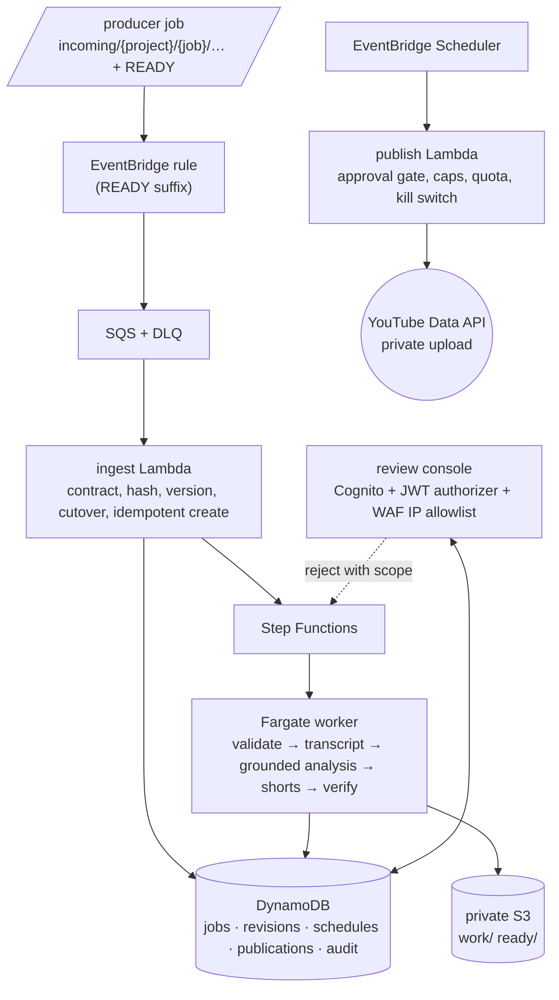

> **AI-assisted development**  
> This project uses AI-assisted tools during development under continuous human supervision. Architectural, editorial, security, and release decisions remain subject to human review.

# another-youtube-auto-publisher

Review-first YouTube publishing pipeline on AWS. A producer uploads a master video
and a manifest under `incoming/{project}/{job}/` and writes `READY` last; the
pipeline validates the job against the versioned contract, transcribes and analyses
it, renders 9:16 Shorts, and presents everything in a private console. Nothing is
uploaded until the owner approves it; approved assets are uploaded **private**,
on a schedule, through the owner's own OAuth authorization.

> **Available languages**: [English (current)](README.md) | [Italiano](README.it.md)

## Hard rules

- Only a `READY` marker created at or after the immutable `cutover_at` triggers a
  job. Existing objects and existing channel videos are never imported or crawled.
- The manifest (`contracts/video-job-manifest/1.0.0/schema.json`) is authoritative
  for question boundaries, rights and editorial flags; analysis may enrich, never
  override.
- Human approval is mandatory per asset. The publisher never flips a video public;
  `publishAt` is requested only when the Google API project is marked audited.
- A kill switch (`PUBLISH_KILL_SWITCH`, on by default) pauses publishing without
  touching review.
- No credentials in Git. OAuth secrets live in Secrets Manager; only the publish
  function can read them.

## Architecture



Job states: `INGESTED → VALIDATING → ANALYZING → GENERATING_ASSETS → AWAITING_REVIEW`,
then `REPROCESS_REQUESTED` (scopes `METADATA_ONLY`, `SHORTS_ONLY`,
`TRANSCRIPT_AND_ANALYSIS`, `FULL`) or `APPROVED → SCHEDULED → UPLOADING_PRIVATE →
VERIFYING → UPLOADED_PRIVATE | PUBLISHED`; `FAILED` and `CANCELLED` as documented in
`autopublisher/domain.py`. Every revision is immutable and every action is audited.

## Layout

| Path | Role |
|---|---|
| `contracts/video-job-manifest/1.0.0/` | JSON Schema, valid/invalid fixtures, event fixtures |
| `autopublisher/contract.py` | schema + semantic validation with stable error codes |
| `autopublisher/ingest.py` | READY-driven, idempotent ingestion |
| `autopublisher/domain.py`, `jobstore.py` | states, revisions, audit; local JSON and DynamoDB stores |
| `autopublisher/providers/` | transcription and analysis interfaces, mock/AWS implementations, grounding |
| `autopublisher/shorts.py`, `render.py`, `processing.py` | manifest-first Shorts, ffmpeg rendering and verification, revision runner |
| `autopublisher/review.py`, `console.py` | review actions and the server-rendered console |
| `autopublisher/publishing.py`, `youtube.py` | approval-gated publisher, fake and real adapters, Data API client |
| `autopublisher/local.py` | one-command local stack and CLI |
| `autopublisher/pipeline.py`, `worker/` | Lambda entry points and the Fargate worker |
| `infra/` | OpenTofu/Terraform stack |
| `docs/` | discovery, reconciliation, ADRs, runbook, cost estimate, release readiness, evidence |

## Local development (no AWS, no real publishing)

```bash
make setup                      # uv venv + dev dependencies
make test                       # ruff + pytest (real ffmpeg renders included)
make e2e                        # generated fixture through ingest → review → fake upload
make serve                      # console on http://127.0.0.1:8080 with a seeded owner
```

Drop a job into `./local/bucket/incoming/quiz-al-volo/<job_id>/` (source, manifest,
then `READY`): the poller ingests and processes it. CLI equivalents:

```bash
python -m autopublisher.local ingest   --bucket-root B --state-root S
python -m autopublisher.local status   --state-root S [--job ID]
python -m autopublisher.local confirm  --state-root S --job ID --asset master
python -m autopublisher.local approve  --state-root S --job ID --master --short short-01
python -m autopublisher.local reject   --bucket-root B --state-root S --job ID --reason "…" --scope SHORTS_ONLY
python -m autopublisher.local schedule --state-root S --job ID --asset master --at 2026-10-01T10:00
python -m autopublisher.local publish  --bucket-root B --state-root S --now 2026-10-01T10:00:00Z   # fake adapter
```

`.env.example` lists every setting. `LOCAL_MODE` is refused outside
`ENVIRONMENT=local`; `YOUTUBE_MODE=real` is refused together with `LOCAL_MODE`.

## Deploy (owner action; needs authorization and a budget)

```bash
scripts/build_layer.sh                        # Lambda dependency layer
cd infra && tofu init && tofu plan -var-file=prod.tfvars   # cutover_at, review_ip_allowlist, owner_email are required
tofu apply -var-file=prod.tfvars
tofu output worker_image_push                 # build and push the worker image
python scripts/authorize.py                   # one-time owner consent → put the JSON into the youtube-publisher secret
```

Publishing stays off until `publish_kill_switch=false`, `publish_schedule_enabled=true`
and `youtube_mode=real` are set deliberately. See `docs/operations-runbook.md`.

## Documentation

- `docs/repository-reconciliation-report.md`, `docs/discovery-report.md`
- `docs/adr/` — decisions and rejected alternatives
- `docs/operations-runbook.md`, `docs/cost-estimate.md`
- `docs/release-readiness.md` — every check with its status and evidence
- `THIRD_PARTY_NOTICES.md`

## License

[MIT](LICENSE).
