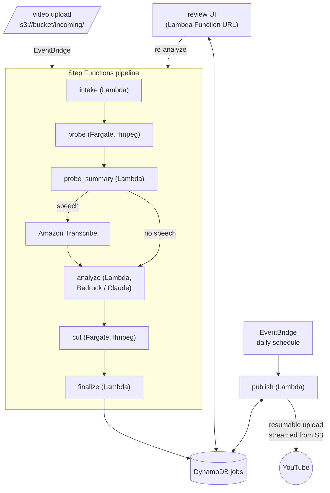

# another-youtube-auto-publisher

Fully automated YouTube publishing on AWS: drop a raw video in S3, the pipeline
analyzes it with Claude (Bedrock vision), extracts meaningful Shorts, generates
English metadata, and publishes everything on a daily cadence after a human
review step.

> **Available languages**: [English (current)](README.md) | [Italiano](README.it.md)

## Architecture



The worker and the Lambdas exchange artifacts through the bucket
(`work/<job>/` for probe output, mosaics, transcript and plan; `ready/<job>/`
for the rendered 9:16 clips).

## Flow

1. **intake** — the S3 event creates the job record (an optional
   `<video>.json` sidecar provides `youtube_id` for a video already on
   YouTube, `language` to skip language identification, `prompt` as free-text
   guidance for the analysis).
2. **probe** (Fargate, ffmpeg) — metadata, scene changes, loudness curve, VAD
   speech detection, timestamped frame mosaics, audio track.
3. **transcribe** — Amazon Transcribe, only when speech was detected.
4. **analyze** — Claude on Bedrock reads the mosaics + transcript and plans
   Short segments plus English metadata for everything.
5. **cut** (Fargate, ffmpeg) — renders each segment as a 9:16 Short (blurred
   background, original frame centered, content untouched).
6. **finalize** — job goes to `PENDING_REVIEW`.
7. **review** — approve in the web UI, or tweak the prompt and re-analyze.
8. **publish** (daily) — main video uploaded unlisted, then one Short per day
   (each linking the full video); when all Shorts are live the main video goes
   public and the job is `DONE`.

Job lifecycle: `ANALYZING → PENDING_REVIEW → APPROVED → PUBLISHING → DONE`
(`ERROR` from any active state, re-analyze allowed from review and error).

## Layout

| Path | Role |
|---|---|
| `autopublisher/models.py` | Pure domain model: jobs, Shorts, transitions, YouTube metadata rules |
| `autopublisher/storage.py` | DynamoDB persistence |
| `autopublisher/pipeline.py` | Glue Lambda for Step Functions (intake / probe_summary / finalize / fail) |
| `autopublisher/analyze.py` | Bedrock analysis Lambda |
| `autopublisher/publish.py` | Scheduled publisher Lambda |
| `autopublisher/youtube.py` | Stdlib-only YouTube Data API client (resumable uploads streamed from S3) |
| `autopublisher/webui.py` | Review web UI (Lambda Function URL, server-rendered) |
| `worker/` | Fargate ffmpeg worker (probe / cut) + Dockerfile |
| `scripts/authorize.py` | One-time local OAuth flow to obtain the YouTube refresh token |
| `infra/` | Terraform: bucket, jobs table, Lambdas, Fargate task, Step Functions, EventBridge |

## Review UI

`terraform output webui_url` prints a link with a `?token=…` — open it once
and a cookie takes over. The UI lists the jobs, previews each Short (presigned
S3 video), shows titles/descriptions/tags and the model's reasoning, and
offers two actions: **Approve** (starts publishing) and **Re-analyze** with an
optional prompt (restarts the pipeline from the analysis step, reusing probe
artifacts and transcript).

## YouTube credentials

1. Google Cloud console → create an OAuth client (type **Desktop app**),
   download `client_secret.json`.
2. `python scripts/authorize.py` — consent in the browser, get `oauth_token.json`.
3. `aws secretsmanager create-secret --name youtube-publisher --secret-string file://oauth_token.json`
4. Point the publisher Lambda at it: `YOUTUBE_SECRET=youtube-publisher`
   (Terraform default already matches).

## Environment variables

| Variable | Used by | Meaning |
|---|---|---|
| `BUCKET` | all | the pipeline S3 bucket |
| `JOBS_TABLE` | all | DynamoDB jobs table |
| `MODEL_ID` | analyze | Bedrock model id (a Claude vision model) |
| `MIN_SHORTS` / `MAX_SHORTS` | analyze | segment count bounds (default 2 / 6) |
| `YOUTUBE_SECRET` | publish | Secrets Manager name/ARN with the OAuth JSON |
| `WEBUI_TOKEN`, `STATE_MACHINE_ARN` | webui | access token and pipeline to restart |
| `MODE`, `JOB_ID`, `VIDEO_KEY`, `PLAN_KEY` | worker | set by the Step Functions Fargate task |

## Local development

The worker runs without AWS:

```bash
python worker/worker.py probe --local video.mp4 --workdir /tmp/probe
python worker/worker.py cut   --local video.mp4 --workdir /tmp/probe  # needs plan.json in workdir
```

Tests cover the pure layers (model, plan cleaning, YouTube client protocol,
web UI routing):

```bash
pip install -e ".[dev]"
pytest
```

## Deploy

Everything is Terraform (`infra/`); region and credentials come from the
environment (`AWS_REGION` / profile).

```bash
cd infra
terraform init
terraform apply                       # see variables.tf for the knobs
# build & push the worker image (exact commands in the output):
terraform output worker_image_push
# YouTube credentials (once): see the section above, then
aws secretsmanager create-secret --name youtube-publisher --secret-string file://oauth_token.json
# review UI link (keep it private, it embeds the access token):
terraform output webui_url
```

Then drop a video: `aws s3 cp video.mp4 s3://<bucket>/incoming/`.

Notes:
- `model_id` defaults to an `eu.` Bedrock inference profile — switch the prefix
  to `us.`/`apac.` to match your region, and enable model access in Bedrock.
- The worker runs in the default VPC with a public IP (to pull the image and
  reach S3); pass `vpc_id`/`subnet_ids` to place it elsewhere.
- The sidecar `language` value is passed to Amazon Transcribe, so use a locale
  code like `it-IT` or `en-US`, not a bare `it`.
- The publisher fires daily at 15:00 UTC (`publish_schedule`).

## License

[MIT](LICENSE).
